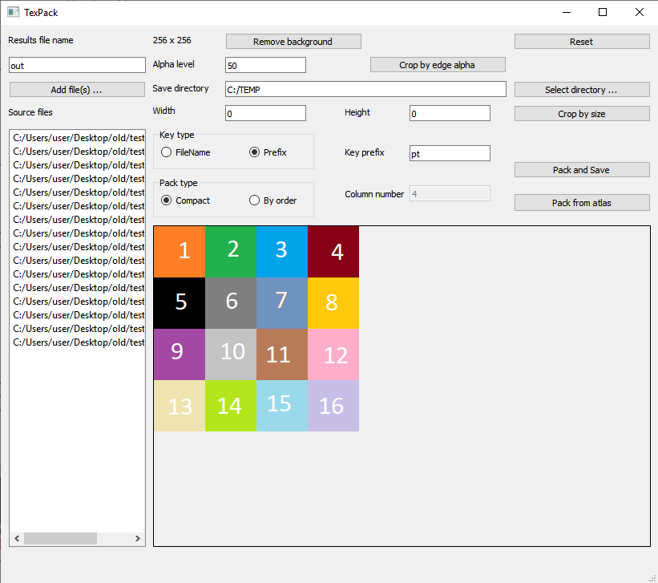

PNG files packer (create texture atlas).

Passed:
1) Remove fill color from image
2) Crop image (check transparent pixels)
3) Create packed image
4) Export to plist format
5) Fix artifacts while image create
6) Add Reset, Select Directory, Path label, Alpha value
7) Remove image in list by DEL key
8) Naming frames inside plist file by png files names or prefix
9) Preview selected source image (result image once on finish)

Need test:
1) Save changes (remove fill color and crop) at session
2) Apply changes to all pictures
3) Sizing at window (packed picture size more than free space on form)
4) Remove/add pictures in list view (half)
5) Preview result image

  

Using in cocos2d-x:
<pre>
SpriteFrameCache* cache = SpriteFrameCache::getInstance();
cache->addSpriteFramesWithFile("resources/out.plist");

auto visibleSize = Director::getInstance()->getVisibleSize();
Vec2 origin = Director::getInstance()->getVisibleOrigin();

auto frame = a->getSpriteFrameByName("pt0");
auto sprite = Sprite::createWithSpriteFrame(frame);
sprite->setPosition(0, 0);
sprite->setAnchorPoint(Vec2(0,0));
sprite->retain();
this->addChild(sprite);
</pre>

 

Deploy

<pre>
cd C:\Qt\5.15.2\mingw81_64\bin 
windeployqt E:\QtProjects\build-test1-Desktop_Qt_5_15_2_MinGW_64_bit-Release\release
add libwinpthread-1.dll, libstdc++-6.dll, libgcc_s_seh-1.dll
</pre>
